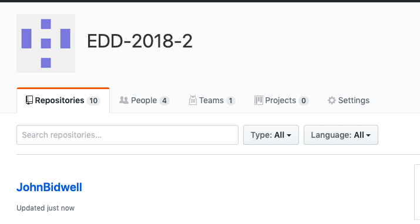
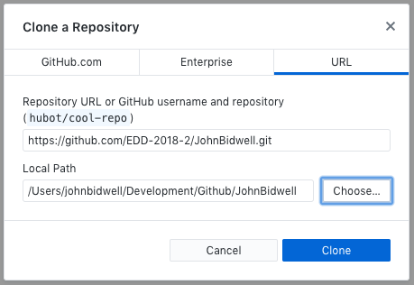
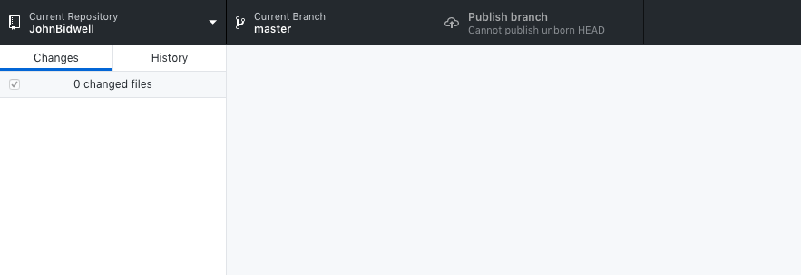
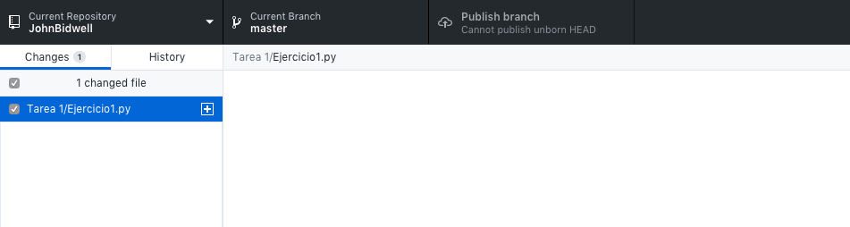
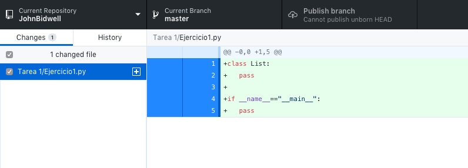
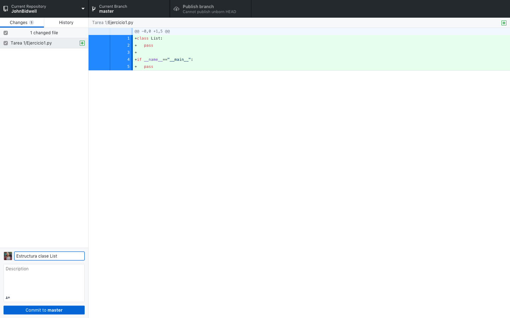
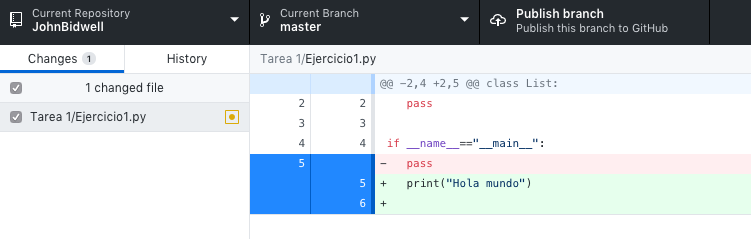
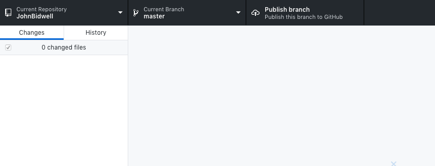
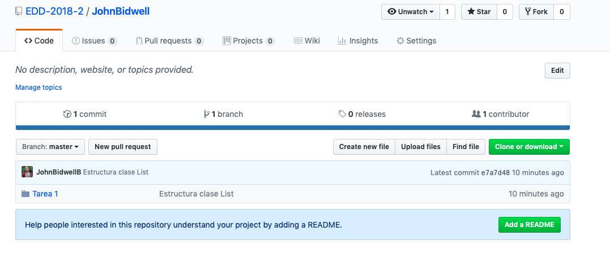

# Tutorial de Github 

En esta guía aprenderemos a utilizar Github a través del programa [Github Desktop](https://desktop.github.com).

## Instrucciones para tarea

Se ha creado una organización dentro de Github (algo similar a un grupo) en donde se encuentran los repositorios de cada uno de los alumnos, donde el nombre del repositorio es `NombreApellido`.

### Flujo de trabajo

Las siguientes acciones serán todas ejecutadas dentro de Github Desktop.

1. Clonar repositorio

Clonar un repositorio consiste, básicamente, en importar todos los datos alojados en un repositorio en Github a nuestro PC, de modo que podamos trabajar con los archivos.

Para este caso, lo que debemos hacer el clonar el repositorio correspondiente a cada alumno.

En Github Desktop pulsar `Menu` -> `File` -> `Clone repository` -> `URL`, esto abrirá la siguiente ventana en donde debemos pegar el link correspondiente a nuestro repositorio.

La URL de nuestro repositorio está compuesta por `https://github.com/EDD-2018-2/NombreApellido.git`, donde `NombreApellido` debe ser reemplazado por su nombre y apellido correspondiente. Luego pulsar `clone`.

2. Abrir carpeta de trabajo

Una vez clonado el repositorio, debemos abrir en nuestro editor de texto preferido la carpeta de nuestro repositorio.

3. Creación de archivos para desarrollo

En nuestra carpeta de trabajo procederemos a realizar todas las acciones que normalmente hacemos (crear carpetas, archivos, etc). Para el siguiente ejemplo procederé a crear una carpeta llamada `Tarea 1` y un archivo llamado `Ejercicio1.py`.

Una vez creado este archivo, Github Desktop detecta automáticamente estos cambios.

4. Desarrollo del código

Cada vez que escribamos código en algún archivo dentro de nuestro repositorio y guardemos dicho archivo, Git detecta qué archivos y en qué parte ha sufrido modificaciones.

Aquí podemos ver que hemos añadido 5 líneas de código.

5. Creación de un commit

Una vez que teneos una serie de cambios en nuestros archivos, procedemos a crear un commit (confirmación de un conjunto de cambios), el cuál contiene los archivos que han sufrido modificaciones y un mensaje en el cuál se describe qué es lo que se hizo en dicho commit.

Una vez ingresado el mensaje, pinchamos el botón `Commit to master`.

6. Desarrollo tarea

La idea de todo esto, es que a medida que van avanzando en el desarrollo de su tarea vayan indicando los distintos avances que han tenido a través de commits. Es por esto que deben realizar los pasos 4 y 5 hasta que completen la versión final de su código.

Github detecta los cambios efectuados en nuestros archivos posterior a un commit (eliminación de líneas de código, adición de código, etc). De manera de visualizar todas las modificaciones que han ocurrido en los archivos.

7. Subir código a Github

Una vez que tengan finalizado su desarrollo, debemos subir nuestros cambios a Github. Para esto lo que se hace es un `Push` a nuestro repositorio en Github. En Github Desktop lo realizamos pinchando el botón `Publish Branch`.

Con esto podremos visualizar nuestro desarrollo en la página de nuestro repositorio (https://github.com/EDD-2018-2/NombreApellido.git).

---

Espero esta pequeña guía les sea útil para la realización de sus tareas y toda su vida como ingenieros. 

Github incluye muchas más herramientas y opciones, les recomiendo leer articulos, tutoriales, o cualquier cosa relacionada a Git para que aprendan en mayor profundidad esta tecnología que es utilizada en cualquier proyecto informático.

